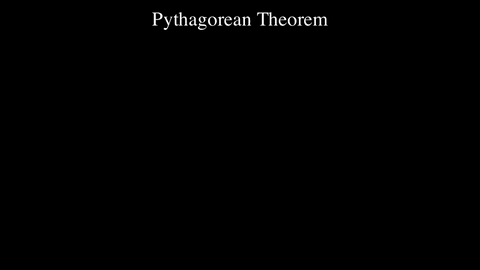

# Manim Nodes

A visual node-based editor for creating [MANIM](https://www.manim.community/) animations without writing code. Build mathematical animations by connecting nodes in a drag-and-drop canvas — from simple shape sequences to 3D parametric curves and geometric proofs.

## Examples

### Basic Shapes
Circle, Square, and Text with a FadeIn / Write sequence.


### Pythagorean Theorem
Animated rearrangement proof of a^2 + b^2 = c^2 with labeled triangles and edge squares.



### 2D Parametric Curves
Two parametric curves (t sin 2t, cos(t-pi)-t) drawn with Write, then traced by animated dots.


### 3D Parametric Curves
The same parametric curves lifted into 3D with Axes3D, NumberPlane, and camera orientation.


### Lorenz Attractor
Live-plotted Lorenz strange attractor in 3D with rotating camera.


### Square Root of 2 Construction
Euclidean construction of sqrt(2) as the diagonal of a unit square, with the Pythagorean identity.


## Features

- **Visual Node Editor** — Drag-and-drop canvas powered by React Flow
- **Live Preview** — Real-time animation preview via WebSocket
- **122 Node Types** — Shapes, animations, math, 3D, camera, vector/matrix ops, and utilities
- **Auto-Save** — Automatic graph persistence with dirty-state tracking
- **Export** — High-quality video export (480p to 4K, 15-60fps, MP4/GIF)
- **3D Support** — 3D shapes, Axes3D, camera orientation and movement
- **Frames** — Resizable group frames for organising complex graphs
- **Docker** — One-command deployment with Docker Compose

## Quick Start

### Docker (Recommended)

```bash
docker-compose up -d
open http://localhost:8000
```

### Manual Setup

#### Backend

```bash
python3 -m venv ~/.venvs/manim-nodes
source ~/.venvs/manim-nodes/bin/activate
pip install -r backend/requirements.txt
uvicorn backend.main:app --reload --host 0.0.0.0 --port 8000
```

#### Frontend

```bash
cd frontend
npm install
npm run dev
```

Access the frontend at http://localhost:5173

## System Requirements

- **Python** 3.10+
- **Node.js** 18+
- **FFmpeg** (video rendering)
- **LaTeX** (mathematical text rendering)
- **Docker** (optional, recommended)

## Available Node Types (122)

| Category | Count | Nodes |
|----------|-------|-------|
| **Shapes 2D** | 11 | Angle, Arrow, Circle, IsoscelesTriangle, Line, Polyline, Rectangle, RegularPolygon, RightTriangle, Square, Triangle |
| **Shapes 3D** | 6 | Axes3D, Cone, Cube, Cylinder, Sphere, Torus |
| **Animations** | 39 | AnimationGroup, ApplyWave, Broadcast, Circumscribe, Create, DrawBorderThenFill, FadeIn, FadeMorph, FadeOut, FadeToColor, Flash, FocusOn, GrowArrow, GrowFromCenter, GrowFromEdge, GrowFromPoint, Indicate, Morph, MorphFromCopy, MorphMatchingShapes, MorphMatchingTex, MoveAlongPath, MoveTo, ReplacementMorph, Rotate, Scale, Sequence, Show, ShrinkToCenter, SpinInFromNothing, SpiralIn, SquareFromEdge, Swap, Transform, TransformInPlace, Uncreate, Unwrite, Wiggle, Write |
| **Text & Math** | 11 | Axes, DisplayMatrix, Dot, LineLabel, LinePlot, MathTex, NumberPlane, ParametricFunction, Text, TextCharacter, Vector |
| **Camera** | 3 | MoveCamera, SetCameraOrientation, ZoomCamera |
| **Math Ops** | 42 | Arithmetic, Vec3 ops, Matrix ops, constants (RIGHT, LEFT, UP, DOWN, etc.), Color |
| **Utilities** | 9 | DebugPrint, ExposeParameters, ExtractEdges, FunctionCall, FunctionDef, GetVertex, ImportGraph, Junction, PythonCode |
| **Grouping** | 1 | Group |

## Architecture

```
manim-nodes/
├── backend/
│   ├── api/           # REST endpoints + WebSocket handler
│   ├── core/          # Validation, code generation, rendering
│   ├── models/        # Pydantic data models
│   ├── nodes/         # Node type definitions (8 modules)
│   ├── examples/      # Built-in example graphs
│   └── main.py        # FastAPI entry point
├── frontend/
│   ├── src/
│   │   ├── components/  # NodeEditor, Preview, TopBar, Palette, ...
│   │   ├── store/       # Zustand stores (graph, preview, UI)
│   │   ├── api/         # REST client
│   │   └── websocket/   # Preview WebSocket
│   └── package.json
├── scripts/             # GIF export and utilities
├── Dockerfile
└── docker-compose.yml
```

**Backend:** FastAPI + MANIM CE + Pydantic
**Frontend:** React 18 + TypeScript + React Flow + Zustand + TailwindCSS

### Data Flow

1. User creates a node graph in the React Flow canvas
2. Graph auto-saves to backend via REST API
3. "Render Preview" sends the graph over WebSocket
4. Backend generates Python code from the graph and renders with MANIM
5. Video URL streamed back via WebSocket; frontend plays it in the preview panel

## Development

### Adding New Nodes

1. Create a node class in `backend/nodes/<category>.py` extending `NodeBase`
2. Implement `to_manim_code()`, `get_inputs()`, `get_outputs()`
3. Register in `NODE_REGISTRY` in `backend/nodes/__init__.py`
4. Restart backend — the node appears in the frontend palette automatically

### Running Tests

```bash
# Backend
pytest backend/

# Frontend
cd frontend && npm run lint
```

### Exporting Example GIFs

```bash
python scripts/export_example_gifs.py
```

Renders all built-in examples as GIFs into `docs/examples/`.

## Troubleshooting

| Problem | Fix |
|---------|-----|
| Video rendering fails | Check `ffmpeg -version` and `latex --version` |
| WebSocket won't connect | Verify backend is running: `curl http://localhost:8000/health` |
| Slow preview | Preview uses 480p 15fps by default; complex scenes take longer |

## License

MIT License — see LICENSE file for details.

## Acknowledgments

- [MANIM Community Edition](https://www.manim.community/) — animation engine
- [React Flow](https://reactflow.dev/) — node editor
- Inspired by visual programming tools like Blender's Geometry Nodes
